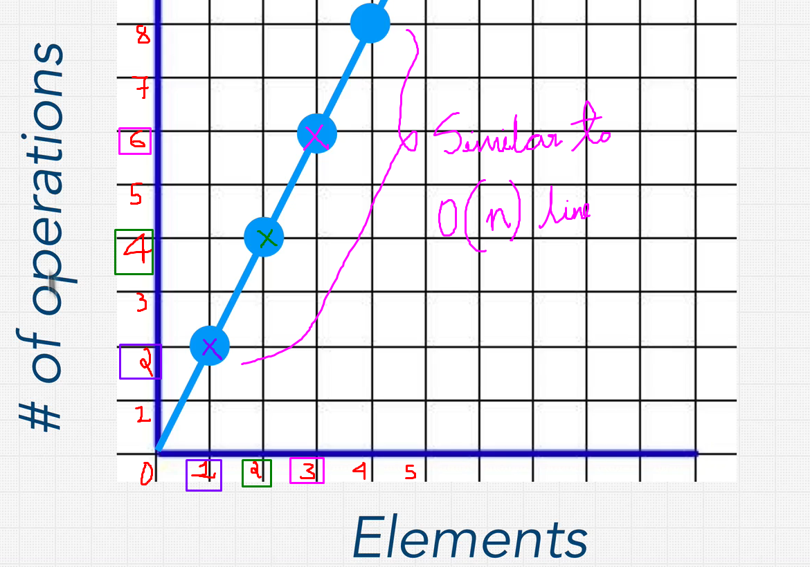
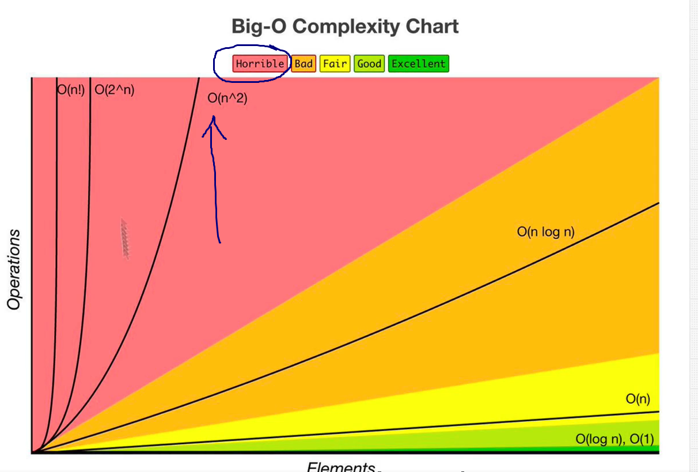
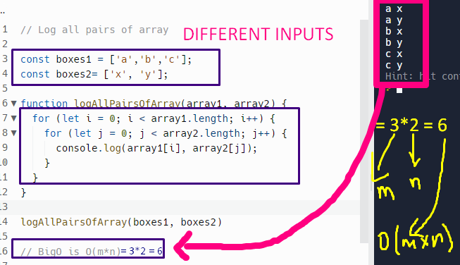

# **BigO**

- The letter 'O' was chosen by Bachmann to stand for 'Ordnung', meaning the **"Order of Approximation"** or **Number Operations**.
- Big O says which code is best based on Scalability.
- Knowing how much time and space a program takes to run and save is very important.
- We should always be prepared for the worst case in any program
- We mainly deal with Space Complexity and Time Complexity
- Space Complexity : The memory that is required by the algorithm.
- Time Complexity : How long it takes for an algorithm to run
- Important thing is BigO is about, how you scale?
- Surely O(n) is better than O(n^2).
- Readability is also most important, in that case, space complexity is more important than time complexity.

# BigO and Scalability

## Program to calculate runtime

Case 1- Small Array:

Case 2- Large Array:

## Summary

- Considering two person coding on two different laptop, if person 'A' runs this code he will get different runtime than a person 'B' for the same code. So at this point there is no way to judge which person's code is good, so for this reason we define 'scalability' irrespective of different coding machines.

- Different functions have different BigO complexities.

- Overall, **'BigO and Scaleability'** means, when we grow bigger and bigger with our inputs, how much does the algorithm slows down? (higher runtime-took long time to run). The less it slows down the better is the code.

- So **instead of 'performance'** , it is **better to use time to measure the efficiency of our function** we can just calculate how many operations takes time on a computer. So **BigO allows us and concern us with how many steps it takes in a function**

## BigO Complexity Chart- Reference ZTM DS and Algo Course Udemy

# O(n)- BigO Notation

- O(n)- Linear Time
- O(n)- Fair(as per graph)
- Example:
  

Explanation:

- No of operations of the for loop is linearly proportional to number of inputs. i.e if largeArray=['nemo'], the for loop will run one time[O(1)], if largeArray=['nemo','nemo','nemo',],the for loop will run three time [O(3)].

-So in O(n) , it takes linear time as shown below for example of O(n)=O(5) as n=5 (n is size of inputs)

# O(1)- BigO Notation

- O(n)- Constant Time
- O(1)- Excellent(as per graph)
- Example:
  

- Explanation:
  Although we have three items in an array, we just output the first element only -boxes[0]

- Graph
  -> This shows that no matter how many elements/item in an array, it has only one operation(Constant line as shown)
  

- Measure the BigO of the function shown
  
- Solution :
  If we observe the program, no matter how many inputs(n), the operation of 'n' inputs [O(n)] is always 2 i.e O(n)=2
  
- **We simple say constant time operation as O(1)**

> Keep in mind that inputs can be of any type of data, it need not be only arrays.

# EXERCISE

[O(n) and O(1) Exercises](https://replit.com/@aneagoie/BigO-Exercise-1#index.js)

## Exercise 1

### Solution :

- O(1)+ O(1)+O(1)
- O(n)+O(n)+O(n)+O(n)

Total BIG O = O(3+4n)

## Exercise 2

### Solution :

- O(1)+ O(1)+O(1)+O(1)
- O(n)+O(n)+O(n)+O(n)+O(n)+O(n)+O(n)

Total BIG O = O(3+4n)

---

> Rememeber to not calculate the BIG O Step by Step!

---

# Simplifying Big O with four rules

- Rule 1: Worst Case
- Rule 2: Remove Constants
- Rule 3: Different terms for inputs
- Rule 4: Drop Non Dominants

---

## Rule 1: Worst Case

- When calculating the big-o we always calculate it for the worst case.

### _Explanation with Example-1_

_Observation-1_ : Here the o/p ran 'n' times based on input 'n' , Even though it 'found nemo', it ran till it reached last item of the array. All the extra runs are wasteful.

_Observation-2_ : Here the o/p ran till it reached 'nemo', once the 'nemo' was found it stopped running (because of break).(Efficient code w.r.t to observation 1)

> So always write code, keeping worst cases in mind, i.e always write efficient code like observation 2. Because Big O cares a lot to worst case condition

> So even if we have this break statement, we're still going to run this ten times because 'nemo', at the end. Best case is if Nemo is at the very beginning and we only have to loop through it once, but worst case, we're still going to have to go through ten. Loops still big o of n. So this is our very first rule. The very first rule is we always care about what is the worst case scenario, because when we talk about scalability, we can't just assume things are going well. We're going to assume that of big O is of n linear time.

---

## Rule 2: Remove Constants

### _Explanation with Example-1:_

**Calculating Big-O of above program is:**

- inputs: items
- output : Operations

**1- To print first item only = O(1)**
-->Because-->No matter how many inputs, output will be constant.

**2- To print first half of the items= O(n/2)**
-->Because --> Inputs are n; and output will be n/2 (items till middle index)

**3- To print hi 100 times = O(100)**
-->Because no matter how much ever the inputs (items or n), output will be printed 100 times.

**TOTAL BIG-O for above program is O(1+n/2+100)=unsimplified**

**BUT RULE NUMBER 2 SAYS THAT WE WAN'T TO DROP CONSTANTS!**

So after droping constants we have **O(n/2+1)** i.e **100+1=101==> 1(in general a constant)**

So now we have O(n/2+1) ;
**But as number of inputs 'n' gets larger and larger '/2' is negligibile. So n/2 becomes ' n '**

So now we have O(n+1) ;
**But as number of inputs 'n' gets larger and larger '+1' is negligibile. So becomes ' n '**

**THEREFORE OVERALL BIG-O is = O(n)=simplified**

### _Explanation with Example-2_:

1. first foreach runs : for every input item of boxes : output will be n times.
2. second foreach runs : for every input item of boxes : output will be n times.

**Big-O : O(n+n)=O(2n)=Unsimplified**

So dropping the constants:

**Big-O : O(n)=Simplified**

Proving with the graph:

So the line is steep , he we do not care about how much steep it is, but it has the characteristics of o(n) graph;

---

## Rule 3: Different terms for inputs

_Observation_ - Consider boxes1 has '10' inputs, and boxes2 has '100' inputs, so 10 is not equal to 100 right? i.e a=10 inputs and b=100 inputs, which means a is not equal to b'

> Just because we have two foreach( ) it doesn't mean to have O(2n) in above observation ! It is again based on different parameters of inputs w.r.t boxes1 and boxes2
> **In that case Big O will be O(a+b)**

---

# O(n^2)- Big O Notation

-O(n^2) = Quadratic Time

## Illustration with Example 1 :

Explanation:

BigO of this is:

- When we see nested loops, we use n\*n , so this becomes O(nxn).
- So BigO of above program is O(n^2).

## Illustration with Example 2 :

Explanation proof with graph:

- Every time the number of elements increases, we have to do n\*n operations, example: 2 elements: 2x2 =4 operations
- 
- 
- 
- we see that o(nxn) = comes as a horrible in graph, our main focus should be in converting red areas(bad) in graph to yellow ones(good)

- Same program with Rule 3: applying different inputs:

---

## Rule 4: Drop Non Dominants and Keep only Dominant terms.

Explanation with an Example:

- 
- **Big O of Above Example is :**
- First part : printing numbers: O(n)
- Second part : printing pair of sums : O(n\*n)
- i.e O(n + n^2) - Unsimplified
- According to rule number 4, we drop the non dominant terms, that means we care only for important ones.
- So we drop first part 'n', as size of 'n' increases 'n'^2
  increases more than 'n'.
- **Big O Simplified : O(n^2)**

---

**Find the Big O of O(x^2 +3x + 100 + x/2)**

- Here x^2 is **most dominant** than all so
  **Solution: O(x^2)**

---

**Find the Big O of below program**

Big O is O(p x q x r) = O(2x2x2)= O(8)

---

# O(n!)- Big O Notation

- factorial time
- we had a nested loop, for every input or element we have!
