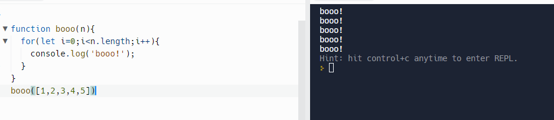
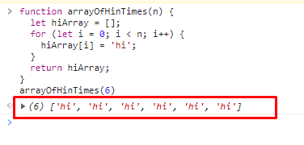

## What causes Space complexity?

- Variables
- Data Structures
- Function Call
- Allocation

---

# Exercise Space Complexity

## Find time complexity and space complexity: Exercise 1

**Solution:**

**Time Complexity** : O(n)

**Space Complexity**:

- Here we dont really care about how big the input is, but we are controll of the operations that it does once the input is received.

- So the **space complexity is O(1)**.

---

## Find time complexity and space complexity: Exercise 2

**Space-Complexity** is : O(n)

- Variables, data structures, function calls, allocations. Those things take space.
- And in our case, we created variables in our loop. Variable 'i' equals to zero. But we've also created data structures, right? We created a new array. So now if we go back, we see that in here, we've created a new array and we fill this array with in loops.
- And again, because of our rules when it comes to Big- O, we ignore the constant time. Let 'i' equal zero space and instead this becomes O(n) ,because we're creating a new data structure and adding memory.
- **So each item is an additional memory space on our computers and times.**
- When it comes to space complexity, you're either adding additional memory that you need to use.

---

**Find Time Complexity :**

'helwoshejhekhiuhudsh'.length

- O(1) , in JavaScript the time complexity is O(1) , in JavaScript.
