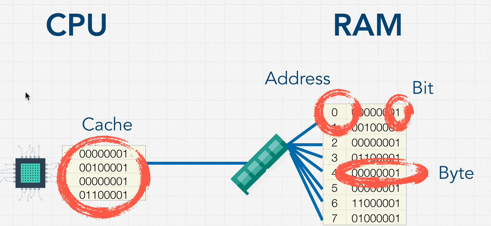
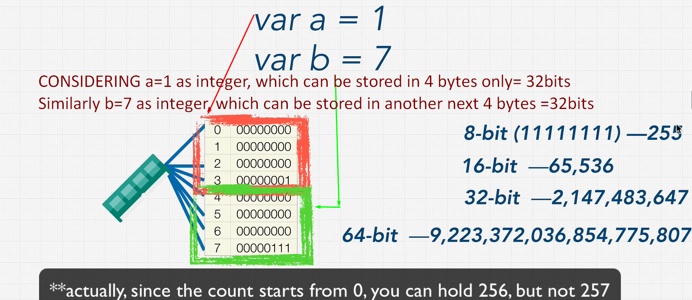
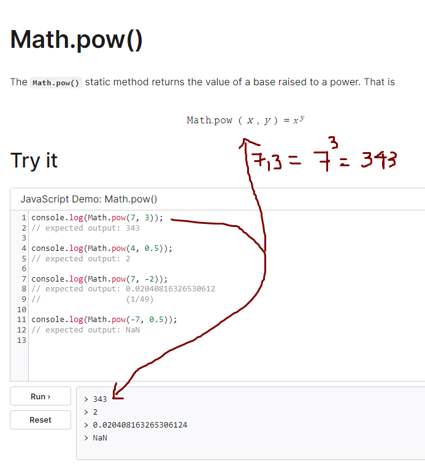
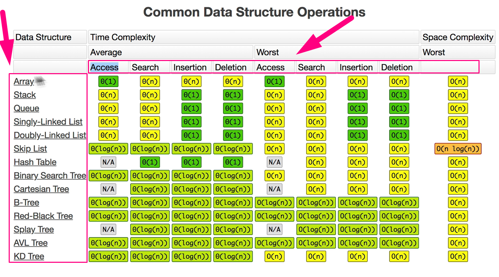

# Introduction

We can use below websites to practice coding:

1. https://replit.com/

2. https://glot.io/new/javascript

# Runtime

How long it takes to run a program is called 'runtime'.

# What is good code?

1. Readable
2. Scalable

## Readable

- **Speed**(Time taken to run the program) and **Memory**(Space taken to run the program).

1. Space Complexity- Memory
2. Time Complexity- Speed

---

# Space Complexity

- When a program been executed, it has two ways to remember the things

1. Heap- where we store variables , that we assign values.
2. Stack- Where we keep track of function calls

## What causes Space complexity?

- Variables
- Data Structures
- Function Call
- Allocation

---

# How to Solve Coding Problems

-- **Skills to have for a very good developer** : Analytic Skills, Coding Skills, Technical Skills, Communication Skills.

-- **Things we should know in coding interviews** :

1. Data Structures : Arrays, Stacks, Queues, Linked Lists, Trees, Graphs, Hash Tables.

2. Algorithm : Sorting, Dynamic Programming, BFS + DFS (Searching)

-- **Google Example Coding Interview**
[Click here to view the video](https://youtu.be/XKu_SEDAykw)

3. [https://javascript.info/array-methods](https://javascript.info/array-methods) Go through this properly.

4. Exercise : Interview Question 1 & 2 [**IMPORTANT VIDEO-REWATCH AND MAKE NOTES OF IT**]

5. Solve Google Interview Question with above 3rd point approach[MAKE NOTES]

---

# Data Structures : Introduction

1. **What is a Data Structure and Algorithms ?**

- A **data structure** is a collection of values.
- **Algorithms** are the steps or processes we put into place to manipulate these collection of values. **It's what allows us to write programs.**
- A person who knows how data structures and algorithms work and how to use them can write programs. Great programs. The beauty is that these are timeless.
- No matter what programming language you use, whether you prefer one library over the other, whether you write code in Angular or react in the front end development world, or you are a game developer. Underneath it all, it's all data structures and algorithms.
- If you understand these, then you can really easily adapt and tackle all sorts of technical problems.

**DATA STRUCTURES + ALGORITHMS = PROGRAMS**

2. **Data Structure**

A data structure is a collection of values. The values can have relationships among them, and they can have functions apply to them. Each one is different in what it can do and what it is best used for. Most important thing to take away is that each data structure is good and is specialized for its own thing.

3. **How Computer store data?** w.r.t CPU, RAM and STORAGE

- ' Variables ' are stored in 'Random Access Memory' (RAM)
- 'Storage' is of solid state like disk drive, pendrive, flash drive, when you turn off your laptop or computer stored things will be still there.
- But in the 'RAM' we loose the memory, when the computer turns off.
- We know that a computer is run by 'CPU', where in CPU does all the actions inside the computer.
- This 'CPU' needs access to 'RAM' as well as the 'STORAGE'.
- The 'CPU' can access the information in 'RAM' a lot faster.

## RAM

- ' RAM ' in the computer is a MASSIVE STORAGE AREA
- 'RAM' contains shelfs (called 'address') which holds the value(8 bit), one address holds 8 bits of value.
- '8 bits' is called '1 byte'. (1byte=8bits)
- i.e each shelf has 1 byte of storage.
- 'CPU' is connected to a 'MEMORY CONTROLLER'
- 'Memory Controller' does the actual reading of address's values.
- 'CPU ' asks 'Memory Controller' w.r.t what's in shelf(address) number '0'
- 'Memory Controller' has connections to all of the shelfs(addresses).

- For a computer 's CPU, it is easy to access the addresses via memory controller for 0th and 1th addresses than 0th and 7th addresses.

- CPU has a very tiny memory called 'CACHE' , which stores recently accessed values.

- WHY IS THIS IMPORTANT FOR DATA STRUCTURE?
  

- JavaScript doesn't have integers, it has '64 Bit flows'
- Data Structure is arrangement of data.
- What is Math.pow() in JavaScript? [https://developer.mozilla.org/en-US/docs/Web/JavaScript/Reference/Global_Objects/Math/pow](https://developer.mozilla.org/en-US/docs/Web/JavaScript/Reference/Global_Objects/Math/pow)
  --> The Math. pow() method returns the value of x to the power of y (xy).
  
  --> consider 'y' is a very large number' then 'x to the power y' in Javascript is 'INFINITY'
- Our goal is to help CPU by making as easy as possible to access the data in RAM with least operations.

4. **Operations On Data Structures**

- There are operations in datastructures as shown below:
  --> 1. INSERTION
  --> 2. DELETION
  --> 3. TRAVERSION
  --> 4. SEARCHING
  --> 5. SORTING
  --> 6. ACCESS

